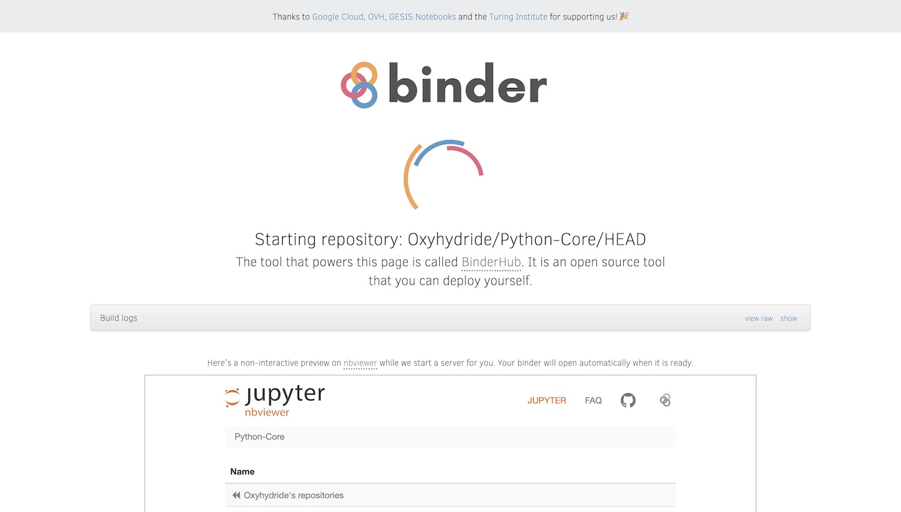
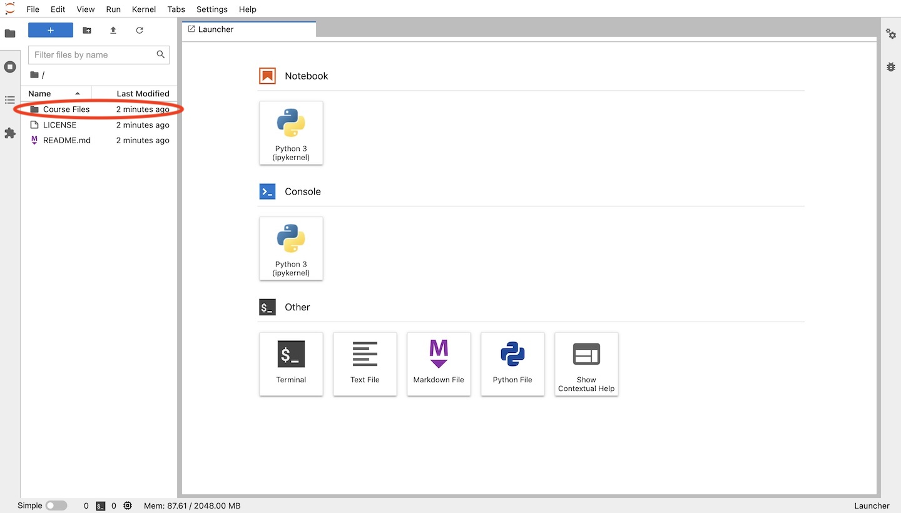

# Python-Core-Course
A beginner's python course in the form of Jupyter Notebooks.
 

Click "launch binder" above to launch the exercises in Binder, a read-only environment for Jupyter Notebooks. This means that your **progress will be erased when the browser tab is closed**. Download the notebook files you wish to keep: right-click on the file and click "Download".

Content of this course is largely adapted from [Sololearn's Python Core](https://www.sololearn.com/learning/1073) course. However, exercises, discussions and assignments in the notebooks are mostly made by me.

## How to access the notebooks properly
### Method 1. Using Binder
1. Click "launch binder" above.
2. Wait for the binder instance to start. If you see a message `Too many users on this BinderHub! Try again soon.`, try to reload the page after a bit.

3. Once binder has loaded, click on `Course Files`.

4. Inside the `Course Files` folder, there are subfolders of the chapters of the course. Each subfolder will (at least) contain:
    - A solution notebook
    - An *empty* notebook (i.e. with no solutions)
Double click on the notebook to open it.
5. After selecting the python interpreter (`Python 3 (ipykernel)`), you can use the toolbar to run cells.

### Method 2. Using Jupyter Notebook Locally
Todo: add